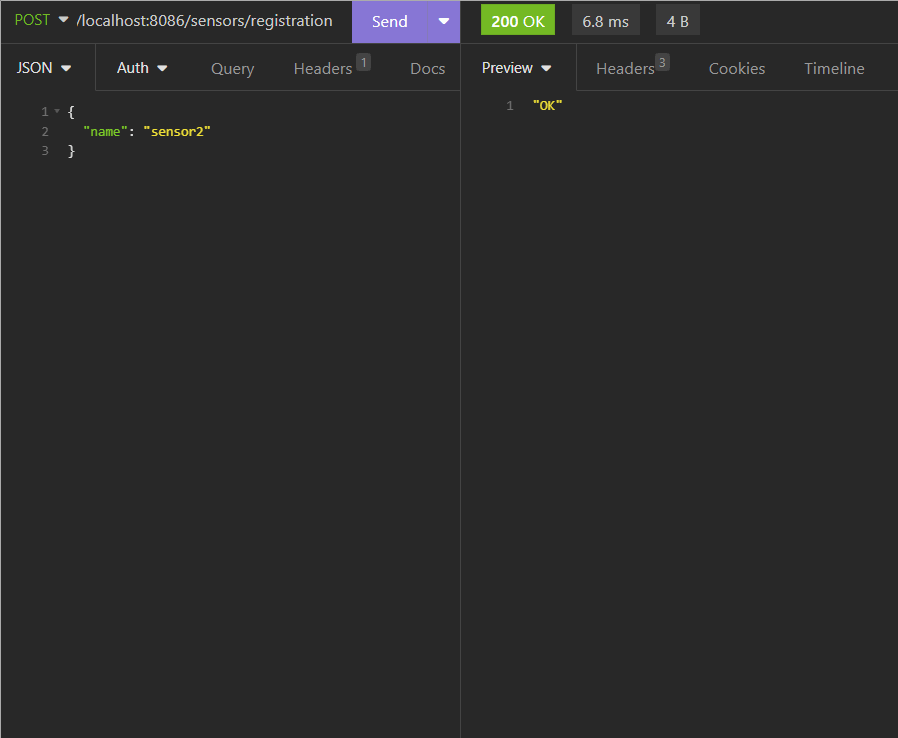

# SensorRESTProject

### Описание проекта
REST API приложение, принимающее данные о температуре.

### Для чего создан проект
Программа создана, для того чтобы попрактиковаться в написании сервиса, использующего API и попробовать Spring Boot. 

### Что представляет из себя
Сервис, имеющий API методы добавления сущностей (сенсор и измерение), получения всех измерений или количества дождливых дней.

### Демонстрация работы методов

